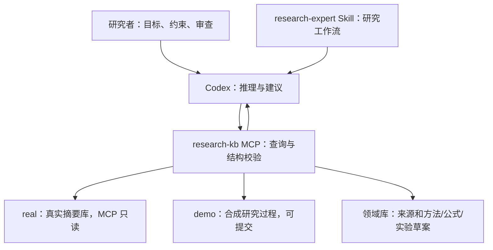

# Research State KB

**面向科研新手的领域知识驱动研究助手：先建立可回溯的知识基础，再设计、组织和判断实验。**

面对论文和数据，用户最需要的往往是“我应该研究什么、下一步做什么实验、为什么这么做、结果出来后如何继续”。本项目的目标是让 Agent 从用户上传的论文、图书、网址以及主动检索的专业知识中建立领域知识库，并结合当前数据提出有依据、有设计、有结果分支的研究路线。

**每项实验的关键方法选择、每个公式都必须能回到具体文献或来源文件；页码、式号是可选补充。** 对改造方法和 Agent 原创新设计，保存其基础来源、改动/推导过程和本次设计文件，不伪造“文献已经做过”的出处。

```text
任务与数据 → 检查/建立领域知识库 → 数据与方法适配
          → 实验候选与设计 → 授权范围内执行 → 结果判断与补充分析
          → 追加项目经验，复核相关知识与决策
```

知识库由三部分组成：**领域知识**提供定义、理论、公式和方法依据；**项目状态**保存问题、数据、实验与决策；**研究经验**保存适用条件、失败教训和例外。Agent 负责推理，知识库提供可核查的依据与历史。

完整目标、来源要求和实施顺序见 **[领域知识驱动的科研助手设计](docs/DOMAIN_RESEARCH_ASSISTANT.md)**。其中的“先建库”由 Agent 组织完成，不要求新手先自行搭建完整资料库；已有知识可复用，缺失部分按当前任务补充。

## 小型项目第一版已实现

面向约 200 篇资料的单个论文项目。新增本地文件归档、方法/公式卡、带依据的实验草案和文件回溯：**SQLite + 文件目录，无新增依赖。** 七个领域库工具加上原有工具，现有 20 个 MCP 工具，另新增 4 个路线工具（总计 24 个）。

先看 **[小项目使用指南](docs/SMALL_PROJECT_GUIDE.md)**。完成安装后可直接运行：

```bash
python scripts/library_demo.py
```

它会在 demo 中跑通“教学来源 → 公式卡 → 实验草案 → 来源文件”，不会执行实验或生成真实结论。

> **当前边界：** 支持归档 PDF/图书/网页快照文件，不自动解析全文、OCR 或下载；公式和方法卡由 Agent 阅读后填写，仍待科学审查。真实实验执行、产物登记与结论更新尚未开放。

一次研究通常跨越许多轮讨论、文献阅读、代码修改和实验。Agent 不仅需要找到相关材料，还需要知道：**现在要解决什么、哪些判断已经有依据、哪些解释仍然成立、为什么选择这条路线，以及什么新证据会让我们改变决定。**

Research State KB 将这些信息组织成可查询、可版本化的外部记录。Agent 在回答和推荐实验前读取它们，将建议关联到证据、适用条件和未决问题；后续再通过受控更新保存研究进展。它不训练模型，也不自行判断哪个科学解释正确。

项目面向一般科学研究。材料实验、机器学习、生态观测、社会科学和空间研究都可以采用这种记录方式。**当前实现是 Codex Skill + 本地 STDIO MCP 原型；领域案例用于说明设计，不代表已完成各领域适配或科研效果验证。** 现有源码目录名 `spatial-unit-kb`、默认演示和旧导入器表述来自早期空间研究，用于其他领域时需要适配。

> **现在可以使用：** 领域来源归档、方法/公式卡、实验草案、文件回溯；原有研究状态查询与 demo 提案提交继续保留。
>
> **尚未开放：** 真实实验产物登记、真实 Observation/Interpretation/Decision/ResearchMemory 更新。旧真实研究状态库目前只登记摘要，MCP 对其只读；新的领域库允许登记来源和未确认的知识/实验草案。仓库不附带真实研究数据。

## 用网页回看实验怎样发展

新增 **实验演进网页**：主图保留开始、推进、分支、暂停/放弃和阶段总结；点击节点查看目标、方法、参数、论文/方法依据、新增数据及变化理由。可以比较两个节点，并在页面内预览已归档来源。

```bash
python scripts/route_demo.py    # 可选：只创建合成演示
python scripts/route_viewer.py  # 本机只读服务
```

打开 http://127.0.0.1:8765/ ，切换“合成演示”即可查看示例。Agent 通过 MCP 追加记录，网页不修改数据。

使用与节点字段见 [实验演进网页指南](docs/ROUTE_VIEWER.md)。执行状态为记录者报告，归档产物不等于独立复算；真实数据不会随网页代码上传。

## 它在研究中保存什么

| 研究者需要回答的问题 | 记录类型 | 用途 |
| --- | --- | --- |
| 研究目标、已知与未知是什么？ | ResearchState | 恢复当前工作上下文，避免把旧目标当成当前目标 |
| 这一说法来自哪里，核对到什么程度？ | Evidence | 保存来源、定位、阅读深度与局限 |
| 我们在解释什么，测量方法本身可靠吗？ | Hypothesis / MethodClaim | 分开机制解释与方法适用性 |
| 下一项实验要区分什么？ | Experiment | 记录问题、对照、评价指标与预期分支 |
| 实际观察到了什么，可以怎样解释？ | Observation / Interpretation | 分开观测模式与解释，保留竞争机制 |
| 为什么改变了判断？ | BeliefChange | 记录前后状态、理由及重新判断条件 |
| 为什么选择这一步，何时停止或重开？ | Decision | 让路线选择可追溯 |
| 以前学到了什么，在哪些条件下不适用？ | ResearchMemory | 保存带上下文和例外的经验 |
| 现在仍然缺什么证据？ | OpenQuestion | 保留未决问题，避免用肯定语气掩盖缺口 |

这些是数据模型的表达能力；当前真实库尚未开放上表全部类型的写入。演示库可以呈现完整链路。

## 知识库怎样影响 Agent 的决策

它通过**改变 Agent 可见的证据和约束，并要求建议说明依据**来影响决策，不会在后台自动选择实验，也没有自动计算“最优下一步”的评分器。

例如，研究者问：“模型 A 的得分提高了，下一步继续扩大模型吗？”

| Agent 从知识库读到的内容 | 对本次建议的影响 |
| --- | --- |
| 当前目标是跨实验室泛化，不是同一数据集内拟合 | 按外部泛化目标评估路线 |
| 当前得分来自按样本随机划分，同一受试对象可能跨训练和测试 | 先核对划分与泄漏风险，暂不把得分提升解释成泛化提升 |
| 历史决策已约定先锁定测试集，再比较架构 | 解释是否有理由重开该决定，避免无依据地换路线 |
| 尚未登记独立测试结果 | 明确证据缺口，不能编造已完成的验证 |
| 剩余预算只允许一次训练 | 提出能够区分当前解释的有限实验，说明成本和取舍 |

在这个**假想案例**中，Agent 可以建议“先做按受试对象分组且预先固定的验证”，而不是直接扩大模型。建议仍须由研究者审查；知识库提供的是理由链与边界，不保证建议一定正确。

实际调用路径是：

1. `get_current_state`、`get_open_questions`：恢复目标与证据缺口。
2. `get_decisions`、`get_research_memory`：查此前选择及适用条件。
3. `find_evidence`、`get_record`、`get_provenance`：核对具体对象、版本和来源。
4. 由 Agent 提出竞争解释、可区分它们的实验、限制与停止条件。
5. 若要记录更新，走提案校验和授权流程；普通讨论不会自动变成已接受的决策。

Skill 是可读的工作协议；它对推理行为的约束需要评测。MCP 强制检查的是字段、引用、版本和命名空间，不能强制 Agent 作出正确的科学判断。

## 三个跨领域例子

以下均为**虚构教学情境**，没有对应的真实实验结果。它们说明研究工作流的用途，完整真实更新链仍是待实现能力。

### 材料实验：信号增加，是否说明性能改善？

- **现有记录：** 某样品的测量信号更高，但样品处理与测量批次同时变化。
- **竞争解释：** 材料本身改变；测量批次或处理过程造成差异；两者同时存在。
- **Agent 如何使用：** 从状态和证据中识别条件变化，提出在可比条件下区分这些解释的对照，而不是立即优化新配方。
- **结果如何影响路线：** 若对照后差异消失，应重审原来对材料性能的解释；若差异保持，也仍需核对其他未控制因素。
- **应留下的记忆：** 本次测量比较需要哪些条件，而不是“这种材料一定无效”。

### 机器学习：方法更准，还是评价方式出了问题？

- **现有记录：** A 在当前测试上优于 B，但数据划分、调参使用的样本和外部测试情况没有全部核对。
- **Agent 如何使用：** 区分“指标/流程能否测到目标能力”的 MethodClaim 与“方法确有目标能力”的 Hypothesis，优先查清评价条件。
- **结果如何影响路线：** 若发现测试泄漏，受影响的是这条评价证据的可用性，不能直接推出“方法在任何条件下都无效”。
- **应留下的记忆：** 哪个结论依赖哪个划分版本；修正后应重评哪些判断。

### 生态观测：记录数量下降，是否代表真实数量下降？

- **现有记录：** 某时期记录减少，同时观测频率或覆盖地点改变。
- **Agent 如何使用：** 将真实变化与观测过程变化作为竞争解释，先检查已有数据是否能区分两者。
- **结果如何影响路线：** 若现有资料无法区分，建议补充有针对性的观测或缩小问题，而不是用更复杂模型替代缺失证据。
- **应留下的记忆：** 结论适用的时间、地点和观测条件，以及重新开放问题所需的证据。

更完整的输入、输出和结果分支见 [科研案例](docs/RESEARCH_EXAMPLES.md)。

## 知识如何更新

更新的对象是外部记录，**不是模型权重**。新会话仍需要加载 Skill 并调用知识库；不是上传文件后 Agent 就永久“学会”。

| 新信息 | 当前可执行的更新 | 边界 |
| --- | --- | --- |
| 本地研究摘要新增或变化 | 适配摘要导入器，预览后通过 CLI 登记新的对象版本与来源快照 | 记录来源表述；不是实验结果的独立认证 |
| demo 中有新观测或解释 | Agent 构造提案 → validate_proposal → 用户授权范围内 commit_demo_proposal | 仅为合成演示，必须保留 evaluation_injection |
| 真实实验结果要求更新判断和决策 | 当前不支持；需补充真实运行产物登记及核验流程 | 不允许借 demo 或直接改文件绕过 |
| 来源发生变化或记录间存在矛盾 | 查询版本和来源，由 Agent/研究者重新审查 | 哈希变化只表示文件改变，不等于科学结论改变 |

设计中的完整研究闭环是：

```text
新文献 / 新实验 / 研究者纠正
  → 核对来源、条件与适用范围
  → 分开证据、观察与解释
  → 提出对假设、方法判断及决策的影响
  → 研究者审查并授权记录
  → 校验引用、命名空间和预期版本
  → 追加版本，保留旧记录
  → 下次查询时恢复最新判断及其历史依据
```

**真实运行到结论更新的闭环尚未全部实现。** 当前仅 demo 可以演示上述记录链。系统也不自动传播结论失效：新证据加入后，依赖旧证据的解释与决定需要显式复核和更新。

逐步操作、版本示例和冲突处理见 [知识更新指南](docs/KNOWLEDGE_UPDATES.md)。

## 怎样帮助科研，以及怎样验证帮助是否发生

设计目标是减少重复解释研究背景、无依据地反复换路线、混淆“看到的结果”和“对结果的解释”，并让跨会话继续研究时能够追问决策的依据。

这些收益尚未通过本项目的科研能力盲测证实。可以在相同模型、任务和预算下比较有无知识库：是否正确引用证据、是否重复已排除路线、能否根据新证据修改建议、是否保留必要的不确定性，以及研究者复核的工作量。不能仅凭回答更长或软件测试通过判断研究效率提高。

## 架构



知识层不调用额外 LLM、embedding API 或 Agent 框架，不需要独显。当前与 Codex 集成；其他 Agent 接入 MCP 在协议层面可行，但未提供或验证对应工作流适配。Codex 自身的联网与账号要求仍由客户端决定。

**尚不提供：** 自动论文下载/全文解析、语义检索、实验执行、自动实验优先级优化、真实实验产物登记、真实判断更新、多用户权限管理或科学正确性判定。

## 运行要求

- Python 3.11（当前测试版本）。
- 支持本地 STDIO MCP 的 Codex 客户端。
- Git，仅克隆和版本管理需要。
- 首次安装依赖需要联网；本地 KB 工具本身不发起模型请求。

## 快速开始

### 1. 下载与安装

克隆仓库并进入目录：

```bash
git clone https://github.com/qiuwutong2/research-state-kb.git
cd research-state-kb
```

选择已有 Python 环境，或单独创建环境：

```bash
conda create -n research-kb python=3.11
conda activate research-kb
python -m pip install -r requirements.txt
```

如果使用 venv，也可在自己的环境中安装同一依赖文件。不要把虚拟环境提交到 Git。

### 2. 初始化本机配置

```bash
python scripts/setup_local.py
```

脚本会使用当前 Python 的绝对路径生成被 Git 忽略的 `.codex/config.toml`，并创建合成 demo 库。它**不会创建真实研究库**；发现已有配置会停止，避免覆盖你的其他 MCP 设置。

成功时显示：

```text
Configured local MCP and synthetic demo. Real store was not created.
```

### 3. 让 Codex 读取演示库

在 Codex 中打开仓库根目录，开启新会话，然后输入：

```text
$research-expert

这次只验收合成 demo。
请通过 research-kb MCP 读取 namespace="demo" 的当前状态，
查询 MC-EVAL-001 和 H-001 的版本与来源，
解释为什么方法判断可以变化，而真实机制假设仍然 unresolved。
只读，不提交任何记录。
```

预期结果：

- 实际调用 MCP 工具，返回 namespace=demo。
- MC-EVAL-001 的最新状态为 weakened；H-001 仍为 unresolved。
- 明确这是人为构造的 A1 演示分支，没有执行真实实验。
- 不将 demo 解释为对真实空间单元或传播机制的认证。

CLI 用户可从仓库目录运行 `codex`，用 `/mcp` 查看连接。工具不可见时检查配置并重启客户端。配置可被识别与会话实际调用成功是两项不同验收。

### 4. 运行测试

```bash
python scripts/run_tests.py
```

测试在独立进程和临时目录中验证版本、引用、回滚、来源摘要、MCP 读写及重启恢复，不依赖作者的研究文件。

## 工具接口

新增领域库的七个工具及字段见 [小项目指南](docs/SMALL_PROJECT_GUIDE.md)。下面是保留的 13 个研究状态工具，二者使用独立存储。

除提案接口默认 demo 外，读取与状态校验默认 real。首次使用公开版本时，请显式选择 demo；缺少真实库会返回错误，系统不会悄悄回退到 demo。

| 工具 | 功能 |
| --- | --- |
| get_current_state | 当前 ResearchState；多状态时指定 state_id |
| get_open_questions | 已登记的开放问题 |
| get_record | 最新或指定版本的任意对象 |
| get_evidence | 证据内容及阅读深度 |
| get_provenance | 精确版本引用的来源链 |
| get_decisions | 当前或历史决策 |
| get_research_memory | 已登记的研究记忆 |
| find_evidence | 证据关键词检索 |
| search_research_memory | 研究记忆关键词检索 |
| validate_state | 存储结构、哈希链及引用检查 |
| check_source_freshness | 真实摘要来源和快照哈希检查 |
| validate_proposal | 内存中校验，不写入 |
| commit_demo_proposal | 仅提交 demo，重检版本与批次摘要 |

## 数据模型与提交

支持 11 类对象：ResearchState、Evidence、Hypothesis、MethodClaim、Experiment、Observation、Interpretation、BeliefChange、Decision、ResearchMemory、OpenQuestion。

每个对象有 ID、类型、版本、命名空间、来源类别、适用范围、数据及精确版本引用。字段与引用类型约束以 [store.py](spatial-unit-kb/phase1a/store.py) 的 FIELDS、ROLES、OPTIONAL_ROLES 为准。

下面是一个完整的 demo 提案：

```json
{
  "proposals": [{
    "id": "Q-DEMO-NEW",
    "kind": "OpenQuestion",
    "expected_version": 0,
    "category": "evaluation_injection",
    "scope": "Synthetic tutorial only",
    "refs": {},
    "data": {
      "unresolved_target": "Which competing explanation remains?",
      "why_unresolved": "No independent observations in this demonstration.",
      "needed_evidence": "An experiment with distinguishable predictions."
    }
  }],
  "namespace": "demo"
}
```

先传给 validate_proposal。经用户授权后，保持 proposals 不变，将返回的 proposal_sha256 作为 validated_sha256 传给 commit_demo_proposal。

该摘要只校验批次一致性，**不是用户授权凭证**。提交时再次检查 expected_version；新对象为 0。重复提交会因版本过期失败，不覆盖旧版本。

## 接入自己的真实摘要

真实摘要导入器仍是项目定制模块：[import_summaries.py](spatial-unit-kb/local_tools/import_summaries.py)。

1. 检查 SOURCES、ALLOWED 及 plan() 中的领域表述，适配自己的摘要路径、字段与研究问题。
2. 准备本地摘要 JSON；不要将敏感源文件纳入 Git。
3. 先执行不写入的预览，审核选中的字段和结论边界。
4. 确认后加 --commit 登记摘要：

```bash
python spatial-unit-kb/local_tools/import_summaries.py import --workspace . --store spatial-unit-kb/data/real_summary
python spatial-unit-kb/local_tools/import_summaries.py import --workspace . --store spatial-unit-kb/data/real_summary --commit
python spatial-unit-kb/local_tools/import_summaries.py check-sources --workspace . --store spatial-unit-kb/data/real_summary
```

这登记的是来源的表述，不是独立验证过的科学事实。MCP 对旧真实研究状态库保持只读；真实 Observation、Interpretation、BeliefChange、Decision、ResearchMemory 转移在存储层仍被禁止。

## 目录

```text
.agents/skills/research-expert/   研究工作流与工具参考
scripts/setup_local.py          本机配置与合成 demo 初始化
scripts/run_tests.py            独立测试套件入口
spatial-unit-kb/
  phase1a/                     版本化存储与合成研究过程
  local_tools/                 CLI、摘要导入和来源检查
  mcp_server/                  STDIO MCP 与集成测试
docs/                          维护与验收说明
.github/workflows/tests.yml     Windows / Ubuntu CI 配置
```

初始化后生成的知识库和本机配置均被 .gitignore 排除。

## 约束与安全边界

- structurally_valid 只表示结构符合规则，不能证明研究结论正确。
- 哈希链用于检测意外修改，不抵抗能重写全部文件的攻击者；不是数字签名。
- STDIO 依赖本机文件权限；没有服务端登录、多租户隔离或权限系统。
- 写入使用本地锁和替换文件；异常遗留锁需要人工确认，没有自动抢锁。
- 搜索是 Unicode 归一化后的关键词 AND 子串匹配，不是相关性排序。
- real 中没有记录表示“尚未登记”，不表示研究历史中“从未发生”。
- 当前仅验证软件行为，尚未完成科研判断、跨会话研究能力的盲测。
- 依赖只锁定直接版本，未提供所有平台的完整依赖锁文件。

## 常见问题

**没有发现 MCP？** 检查是否从仓库根目录打开 Codex，执行 setup_local.py 的 Python 是否已安装依赖，以及 .codex/config.toml 中的路径是否仍有效。移动仓库或环境后，手动更新配置。

**默认读取报错？** 公开版本没有 real 数据，演示时必须传 namespace="demo"。

**已有 config.toml？** 保留现有内容，手动合并 [mcp_servers.research-kb]。可参考 scripts/setup_local.py 中的生成字段；不要覆盖其他 MCP。

**想接入自己的领域？** 先用新增领域库归档资料并建立卡片。旧摘要导入器仍需要领域适配；归档并不自动验证方法适用性。

## 维护、来源与许可

维护流程见 [CONTRIBUTING.md](CONTRIBUTING.md)，验证范围见 [docs/VALIDATION.md](docs/VALIDATION.md)。

本仓库是研究工作区的独立发布副本；未包含真实来源、历史私有评审材料、环境、密钥或下载的上游仓库。运行时使用官方 [MCP Python SDK](https://github.com/modelcontextprotocol/python-sdk)；Skill/MCP 配置参考 [Codex Skills](https://developers.openai.com/zh-Hans/docs/build-skills) 与 [Codex MCP](https://developers.openai.com/zh-Hans/docs/extend/mcp)。

**许可尚未指定。** 仓库可见性不等于授予开源许可；在维护者选择许可前，不宣称为 MIT、Apache 或其他开源授权。第三方依赖遵循各自许可。

## 知识星图：领域与引用联系

本机网页现在也能展示知识库中的领域、资料、方法、公式、实验方案及其引用联系。点击节点查看来源文件、分类理由和被哪些实验使用；与实验脉络页互相导航。

服务启动后打开 http://127.0.0.1:8765/knowledge 。新知识入库后页面每 3 秒自动检查更新，无分类的记录进入待分类区。领域由 Agent 阅读后通过 classify_knowledge 明确登记，不推断未知关系；引用固定到版本。

运行 python scripts/knowledge_demo.py 后访问 http://127.0.0.1:8765/knowledge?namespace=demo 可体验四领域教学示例。详见 [知识星图使用说明](docs/KNOWLEDGE_MAP.md)。
