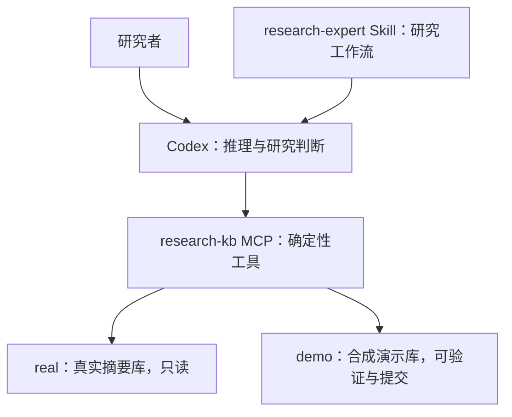

# Research State KB

**给 Codex 使用的本地研究知识库：用 Skill 约束研究判断流程，用 MCP 读取可追溯的研究状态。**

项目起源于空间单元与流感研究，关注的是“目前知道什么、依据是什么、哪些解释仍未排除、下一项实验能区分什么”。它将证据、方法判断、科学假设与研究决策分别保存，避免把更好的拟合、模拟表现或演示结果直接当成真实机制的确认。

> **状态：可运行原型。** 支持本地 STDIO MCP、版本化记录、来源追溯和演示写入；真实库的实验结论与判断更新仍未开放。仓库不包含任何真实项目数据。

## 架构



| 组件 | 职责 |
| --- | --- |
| Codex | 比较解释、设计判别实验、表达不确定性 |
| Skill | 要求先读状态和来源，区分事实、解释、假设与方法判断 |
| MCP | 查询对象、检查引用与版本、追溯来源、验证提交 |
| 本地 JSON 存储 | 保存对象版本、精确引用及变更链 |

知识层不调用额外 LLM、embedding API 或 Agent 框架，不需要独显。Codex 自身的联网与账号要求仍由 Codex 客户端决定。

## 能做什么

- 读取当前研究状态、未决问题、证据、历史决策和研究记忆。
- 按对象 ID 与版本追溯引用关系，检查摘要源文件是否变化。
- 区分科学机制假设 Hypothesis 与方法有效性判断 MethodClaim。
- 使用关键词检索证据和记忆；无需向量数据库。
- 在 demo 中先校验提案，再按预期版本提交，保留历史。
- 为科研讨论保留 unresolved，明确下一步实验的区分能力与限制。

**尚不提供：** 自动论文下载/全文解析、语义检索、GIS 计算、实验执行、真实实验产物登记、真实判断更新、多用户权限管理或科学正确性判定。

## 运行要求

- Python 3.11（当前测试版本）。
- 支持本地 STDIO MCP 的 Codex 客户端。
- Git，仅克隆和版本管理需要。
- 首次安装依赖需要联网；本地 KB 工具本身不发起模型请求。

## 快速开始

### 1. 下载与安装

克隆仓库并进入目录：

```bash
git clone https://github.com/qiuwutong2/research-state-kb.git
cd research-state-kb
```

选择已有 Python 环境，或单独创建环境：

```bash
conda create -n research-kb python=3.11
conda activate research-kb
python -m pip install -r requirements.txt
```

如果使用 venv，也可在自己的环境中安装同一依赖文件。不要把虚拟环境提交到 Git。

### 2. 初始化本机配置

```bash
python scripts/setup_local.py
```

脚本会使用当前 Python 的绝对路径生成被 Git 忽略的 `.codex/config.toml`，并创建合成 demo 库。它**不会创建真实研究库**；发现已有配置会停止，避免覆盖你的其他 MCP 设置。

成功时显示：

```text
Configured local MCP and synthetic demo. Real store was not created.
```

### 3. 让 Codex 读取演示库

在 Codex 中打开仓库根目录，开启新会话，然后输入：

```text
$research-expert

这次只验收合成 demo。
请通过 research-kb MCP 读取 namespace="demo" 的当前状态，
查询 MC-EVAL-001 和 H-001 的版本与来源，
解释为什么方法判断可以变化，而真实机制假设仍然 unresolved。
只读，不提交任何记录。
```

预期结果：

- 实际调用 MCP 工具，返回 namespace=demo。
- MC-EVAL-001 的最新状态为 weakened；H-001 仍为 unresolved。
- 明确这是人为构造的 A1 演示分支，没有执行真实实验。
- 不将 demo 解释为对真实空间单元或传播机制的认证。

CLI 用户可从仓库目录运行 `codex`，用 `/mcp` 查看连接。工具不可见时检查配置并重启客户端。配置可被识别与会话实际调用成功是两项不同验收。

### 4. 运行测试

```bash
python scripts/run_tests.py
```

测试在独立进程和临时目录中验证版本、引用、回滚、来源摘要、MCP 读写及重启恢复，不依赖作者的研究文件。

## 工具接口

除提案接口默认 demo 外，读取与状态校验默认 real。首次使用公开版本时，请显式选择 demo；缺少真实库会返回错误，系统不会悄悄回退到 demo。

| 工具 | 功能 |
| --- | --- |
| get_current_state | 当前 ResearchState；多状态时指定 state_id |
| get_open_questions | 已登记的开放问题 |
| get_record | 最新或指定版本的任意对象 |
| get_evidence | 证据内容及阅读深度 |
| get_provenance | 精确版本引用的来源链 |
| get_decisions | 当前或历史决策 |
| get_research_memory | 已登记的研究记忆 |
| find_evidence | 证据关键词检索 |
| search_research_memory | 研究记忆关键词检索 |
| validate_state | 存储结构、哈希链及引用检查 |
| check_source_freshness | 真实摘要来源和快照哈希检查 |
| validate_proposal | 内存中校验，不写入 |
| commit_demo_proposal | 仅提交 demo，重检版本与批次摘要 |

## 数据模型与提交

支持 11 类对象：ResearchState、Evidence、Hypothesis、MethodClaim、Experiment、Observation、Interpretation、BeliefChange、Decision、ResearchMemory、OpenQuestion。

每个对象有 ID、类型、版本、命名空间、来源类别、适用范围、数据及精确版本引用。字段与引用类型约束以 [store.py](spatial-unit-kb/phase1a/store.py) 的 FIELDS、ROLES、OPTIONAL_ROLES 为准。

下面是一个完整的 demo 提案：

```json
{
  "proposals": [{
    "id": "Q-DEMO-NEW",
    "kind": "OpenQuestion",
    "expected_version": 0,
    "category": "evaluation_injection",
    "scope": "Synthetic tutorial only",
    "refs": {},
    "data": {
      "unresolved_target": "Which competing explanation remains?",
      "why_unresolved": "No independent observations in this demonstration.",
      "needed_evidence": "An experiment with distinguishable predictions."
    }
  }],
  "namespace": "demo"
}
```

先传给 validate_proposal。经用户授权后，保持 proposals 不变，将返回的 proposal_sha256 作为 validated_sha256 传给 commit_demo_proposal。

该摘要只校验批次一致性，**不是用户授权凭证**。提交时再次检查 expected_version；新对象为 0。重复提交会因版本过期失败，不覆盖旧版本。

## 接入自己的真实摘要

真实摘要导入器仍是项目定制模块：[import_summaries.py](spatial-unit-kb/local_tools/import_summaries.py)。

1. 检查 SOURCES、ALLOWED 及 plan() 中的领域表述，适配自己的摘要路径、字段与研究问题。
2. 准备本地摘要 JSON；不要将敏感源文件纳入 Git。
3. 先执行不写入的预览，审核选中的字段和结论边界。
4. 确认后加 --commit 登记摘要：

```bash
python spatial-unit-kb/local_tools/import_summaries.py import --workspace . --store spatial-unit-kb/data/real_summary
python spatial-unit-kb/local_tools/import_summaries.py import --workspace . --store spatial-unit-kb/data/real_summary --commit
python spatial-unit-kb/local_tools/import_summaries.py check-sources --workspace . --store spatial-unit-kb/data/real_summary
```

这登记的是来源的表述，不是独立验证过的科学事实。MCP 对真实库保持只读；真实 Observation、Interpretation、BeliefChange、Decision、ResearchMemory 转移在存储层仍被禁止。

## 目录

```text
.agents/skills/research-expert/   研究工作流与工具参考
scripts/setup_local.py          本机配置与合成 demo 初始化
scripts/run_tests.py            独立测试套件入口
spatial-unit-kb/
  phase1a/                     版本化存储与合成研究过程
  local_tools/                 CLI、摘要导入和来源检查
  mcp_server/                  STDIO MCP 与集成测试
docs/                          维护与验收说明
.github/workflows/tests.yml     Windows / Ubuntu CI 配置
```

初始化后生成的知识库和本机配置均被 .gitignore 排除。

## 约束与安全边界

- structurally_valid 只表示结构符合规则，不能证明研究结论正确。
- 哈希链用于检测意外修改，不抵抗能重写全部文件的攻击者；不是数字签名。
- STDIO 依赖本机文件权限；没有服务端登录、多租户隔离或权限系统。
- 写入使用本地锁和替换文件；异常遗留锁需要人工确认，没有自动抢锁。
- 搜索是 Unicode 归一化后的关键词 AND 子串匹配，不是相关性排序。
- real 中没有记录表示“尚未登记”，不表示研究历史中“从未发生”。
- 当前仅验证软件行为，尚未完成科研判断、跨会话研究能力的盲测。
- 依赖只锁定直接版本，未提供所有平台的完整依赖锁文件。

## 常见问题

**没有发现 MCP？** 检查是否从仓库根目录打开 Codex，执行 setup_local.py 的 Python 是否已安装依赖，以及 .codex/config.toml 中的路径是否仍有效。移动仓库或环境后，手动更新配置。

**默认读取报错？** 公开版本没有 real 数据，演示时必须传 namespace="demo"。

**已有 config.toml？** 保留现有内容，手动合并 [mcp_servers.research-kb]。可参考 scripts/setup_local.py 中的生成字段；不要覆盖其他 MCP。

**想接入通用领域？** 存储结构可复用；Skill 的领域表述和摘要导入器仍需适配。

## 维护、来源与许可

维护流程见 [CONTRIBUTING.md](CONTRIBUTING.md)，验证范围见 [docs/VALIDATION.md](docs/VALIDATION.md)。

本仓库是研究工作区的独立发布副本；未包含真实来源、历史私有评审材料、环境、密钥或下载的上游仓库。运行时使用官方 [MCP Python SDK](https://github.com/modelcontextprotocol/python-sdk)；Skill/MCP 配置参考 [Codex Skills](https://developers.openai.com/zh-Hans/docs/build-skills) 与 [Codex MCP](https://developers.openai.com/zh-Hans/docs/extend/mcp)。

**许可尚未指定。** 仓库可见性不等于授予开源许可；在维护者选择许可前，不宣称为 MIT、Apache 或其他开源授权。第三方依赖遵循各自许可。
